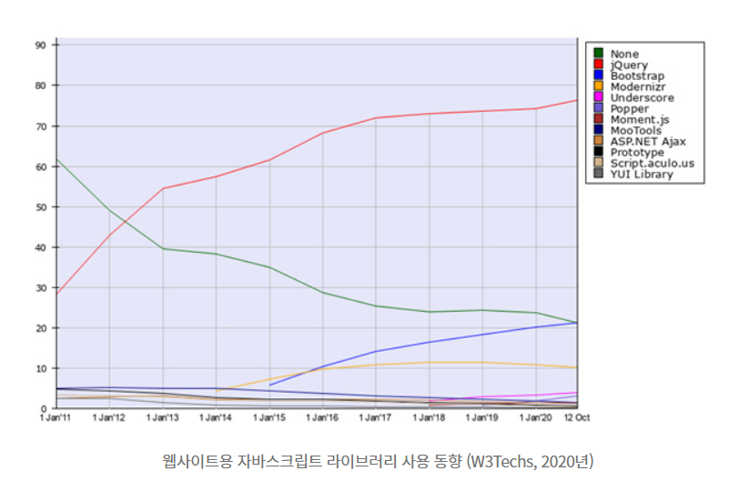
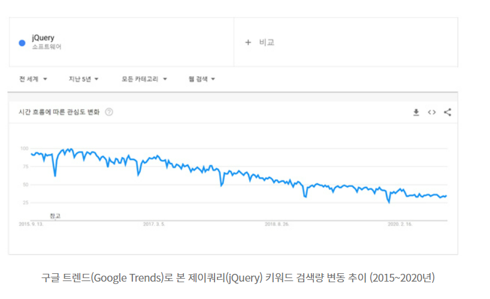

# Jquery의 탄생

Javascript 언어를 간편하게 사용할 수 있도록 단순화시킨

오픈소스 기반의 자바스크립트 라이브러리 입니다.

2006년 존 레식은 크로스 브라우저 Javascript를 작성하는데 어려움을 느끼고 자체 Jquery를 개발했다.

```Javascript

// JavaScript
document.getElementById('targetId');
// jQuery
$('#targetId');

// JavaScript
var xhr = new XMLHttpRequest();
xhr.open('https://...');
xhr.send();
xhr.onload = function(e) {
  // ...
};
xhr.onerror = function(e) {
  // ...
};

// jQuery
$.ajax({
  url: 'https://...',
  success: function(e) {
    // ...
  },
  failed: function(e) {
    // ...
  },
});

```

1. 브라우저 호환성 문제 해결,
2. 간결하고 높은 편의성



2020년 10월 “웹사이트용 자바스크립트 라이브러리 사용 동향”에서 제이쿼리는 76%의 사용률로 압도적인 1위를 기록할 정도로 인기가 높다.

# Jquery의 현재



제이쿼리의 인기는 여전히 높기는 하지만 서서히 낮아지고 있다.

### 1 웹 표준 API의 확장

끊임없는 웹 표준의 발전으로 인해 Jquery를 사용해야만 활용 가능했던 편의 기능을 브라우저에서 기본 API로 제공하고 있다. ex) Fetch API

### 2. 웹 브라우저 환경의 변화

제이쿼리가 본격적으로 사용되기 시작한 2007~2009년에는 익스플로러가 전 세계 시장의 60%이상을 점유하고 있었지만, 버전 업그레이드가 느렸던 반면에 2008년 등장한 크롬은 성능이 우수한 렌더링 엔진을 탑재하였고 웹 표준을 신속하게 반영한 결과 제이쿼리와 같은 라이브러리를 사용하지 않고도 웹 구현이 가능해졌고 크롬은 2013년 이후 점유을 1위를 지키고 있다.

### 3. 가상 돔(Virtual DOM)을 사용하는 라이브러리의 등장

대화형 웹을 구현하기 위해서는 돔조작이 필수적이다.
그러나 대부분의 브라우저에서 돔 조작이 발생할 때 마다 배치나 화면 표시에 많은 연산을 발생시키다보니 브라우저 성능이 낮아지는 문제가 있었다.

그래서 자바스크립트 라이브러리 리액트는 가상돔을 채용하였고
메모리에 가상돔을 구성하여 실제 돔과 비교하여 변경된 부분만 실제 돔에 적용하는 방식으로 뛰어난 웹을 구현 가능해졌다.

가상돔을 가용하는 라이브러리가 많아질 수록 돔을 직접 조작하는 Jquery의 필요성이 줄어들었다.

# Jquery 미래

그럼 Jquery는 공부할 가치가 없는가? 하면 아니다.

제이쿼리가 속해있는 OpenJS재단은 제이쿼리를 노드JS 등과 함께 “영향력 있는 프로젝트”로 분류하였다. 즉, 제이쿼리는 이미 성장 목표에 도달했으며 개발, 유지보수 및 장기 지원의 지속적인 주기를 보장하는 성숙한 프로젝트로 관리하겠다는 것이다. 재단은 다음 버전을 준비하고있으며

여전히 Jquery는 우리 FB프로젝트에서도, 다른곳에서도 여전히 인기있는 **라이브러리**다.

[참고 - Blog](https://s-core.co.kr/insight/view/%EC%A0%9C%EC%9D%B4%EC%BF%BC%EB%A6%ACjquery%EC%9D%98-%ED%98%84%EC%9E%AC%EC%99%80-%EB%AF%B8%EB%9E%98/)

