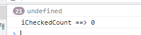

# Web Jquery version

# Mobile Web Jquery version

# Jquery 1.6 이전 이후의 attr(), prop()

[참고 - Jquery](https://api.jquery.com/attr/)

# Sample Code Code

# WEB 1.10.1

# Mobile 3.5.1

# .attr()는 element가 가지는 속성값이나 정보를 조회(style, src, rowspan 등)하거나 세팅하는 형식

# .prop()는 element가 가지는 실제적인 상태(활성화, 체크, 선택여부 등)를 제어하는 업무

​
