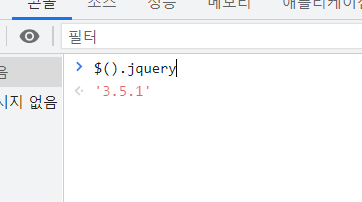

# Jquery의 탄생

Javascript 언어를 간편하게 사용할 수 있도록 단순화시킨

오픈소스 기반의 자바스크립트 라이브러리 입니다.

2006년 존 레식은 크로스 브라우저 Javascript를 작성하는데 어려움을 느끼고 자체 Jquery를 개발했다.



# Jquery, Javascript Sample Code

```Javascript

// JavaScript
document.getElementById('targetId');
// jQuery
$('#targetId');

// JavaScript
var xhr = new XMLHttpRequest();
xhr.open('https://...');
xhr.send();
xhr.onload = function(e) {
  // ...
};
xhr.onerror = function(e) {
  // ...
};

// jQuery
$.ajax({
  url: 'https://...',
  success: function(e) {
    // ...
  },
  failed: function(e) {
    // ...
  },
});

```

1. 브라우저 호환성 문제 해결,
2. 간결하고 높은 편의성


2020년 10월 현재 “웹사이트용 자바스크립트 라이브러리 사용 동향”에서 제이쿼리는 76%의 사용률로 압도적인 1위를 기록할 정도로 인기가 높다.

# Jquery의 현재


제이쿼리의 인기는 여전히 높기는 하지만 서서히 낮아지고 있다.

### 1 웹 표준 API의 확장

끊임없는 웹 표준의 발전으로 인해 Jquery를 사용해야만 활용 가능했던 편의 기능을 브라우저에서 기본 API로 제공하고 있다. ex) Fetch API

### 2. 웹 브라우저 환경의 변화

제이쿼리가 본격적으로 사용되기 시작한 2007~2009년에는 익스플로러가 전 세계 시장의 60%이상을 점유하고 있었지만, 버전 업그레이드가 느렸다. 그러나 2008년 크롬이 등장하였고 점유을을 빠르게 잠식했다. 크롬은 성능이 우수한 렌더링 엔진을 탑재하였고 웹 표준을 신속하게 반영했으며 그 결과 제이쿼리와 같은 라이브러리를 사용하지 않고도
웹 구현이 가능해졌다.

### 3. 가상 돔(Virtual DOM)을 사용하는 라이브러리의 등장

DOM을 제어하기 위해 Jquery가 널리 쓰여졌다. (간결한 문법, 크로스 브라우징)
그러나 크로스브라우징의 필요성도 줄고 Javascript의 문법도 충분하 간결해졌고
브라우저에서 돔 조작을 발생할 때마다 배치나 화면에 표시에 많은 연산을 발생시키다 보니
브라우저의 성능이 낮아이는 문제가 있었다.
그래서 자바스크립트 라이브러리인 리액트는 가상돔을 채용하였고
리액트는 메모리에 가상 돔을 구성하여 실제돔과 차이점을 비교하교 변경된 부분을 실제 돔에
적용하는것으로 성능을 향상 시켰다.

# Jquery 미래

웹 프론트엔드의서 Jquery의 입지는 점점 줄어 들고 있지만
우리 프로젝트에서는 여전히 활발하게 사용중이고
Jquery 재단도 다음 버전을 출시할 예정이기 때문에
Jquery에 살펴 볼 필요가 있다.

# 오늘의 발표 주제 = 웹, 모바일의 Jquery 버전 차이
