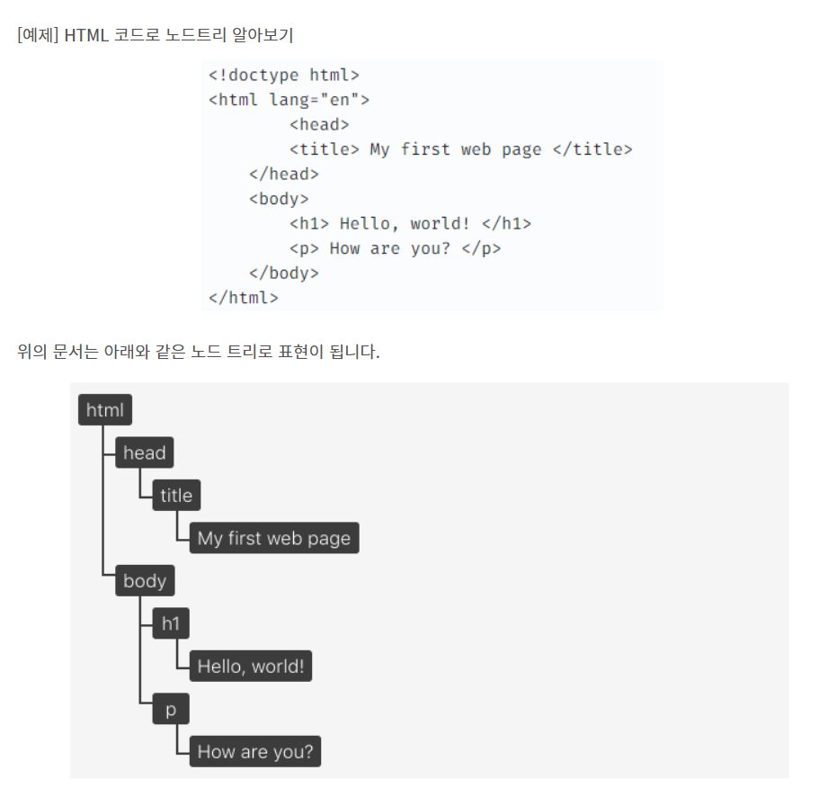
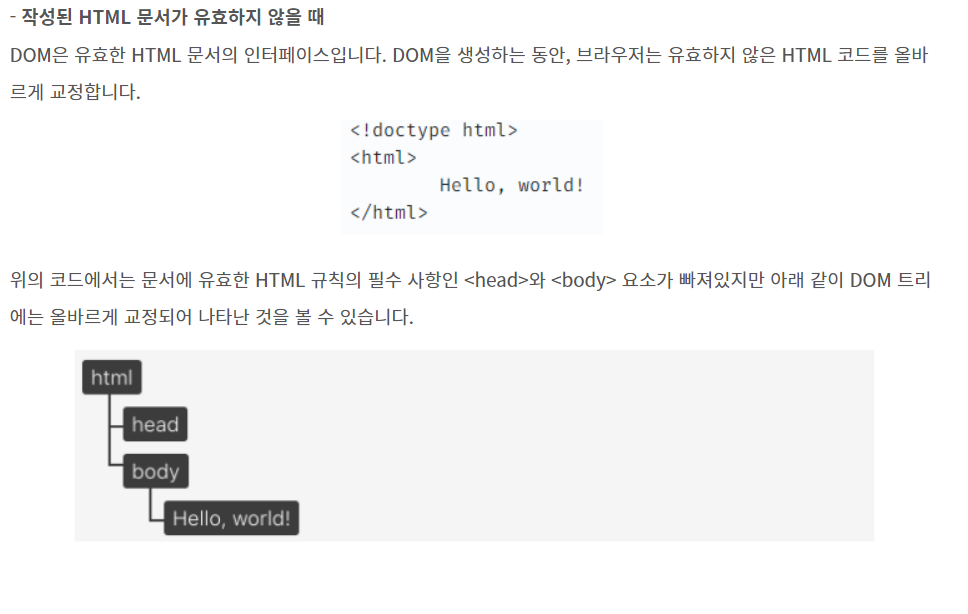
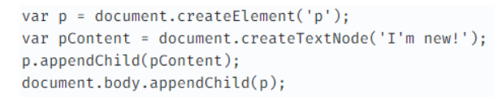
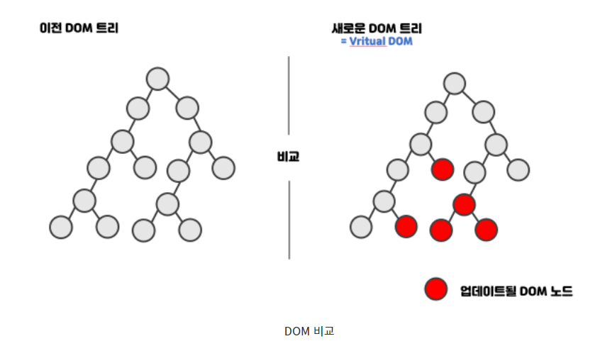

# 웹 페이지 빌드 과정

브라우저가 서버에서 페이지에 대한 HTML 응답을 받으며 화면에 표시되기 전에
많은 단계를 거쳐야 하는데 이 과정을
**CRP(Critical Rendering Path)** 이라고 합니다.

1. Dom 트리 구축
2. CSSOM 트리 구축
3. Javascript 실행
4. 렌더 트리 구축
5. 레이아웃 생성
6. 페인팅

위 과정은 랜더 트리를 기준으로 2가지로 나눌 수 있다.

1,2,3 -> 브라우저는 읽어들인 문서를 파싱하여 최종적으로 어떤 내용을 랜더링 할지 결정함

4.5.6 -> 브라우저는 랜더링을 수행함

### 랜더 트리

웹 페이지에 표시될 HTML 요소들과 이와 관련된 스타일 요소들로 구성됩니다.

랜더트리를 생성하기 위해 아래와 같은 두 모델이 필요함

- DOM : HTML 요소들의 구조화된 표현
- CSSOM : 요소들과 연관된 스타일 정보의 구조화된 표현

렌더트리 동작 순서

1. DOM트리 상의 루트부터 시작해서 각 노드를 순회
2. 보이지 않는 노드 생략
3. 표시되는 각 노드에 대해 적절하게 일치하는 CSSOM 규칙 찾아 적용
4. 계산된 스타일과 함꼐 보이는 노드를 내보냄
5. 마지막으로 화면에 계산된 스타일을 포함한 렌더트리를 출력

# DOM( Document Object Model )

**웹 페이지에 대한 프로그래밍 인터페이스**, 페이지의 콘텐츠 및 구조, 그리고 스타일을 읽고 조작할 수 있는 API를 제공한다.

DOM은 원본 HTML 문서의 객체 기반 표현 방식이며 DOM의 객체 구조는 노드 트리로 표현된다.

또한 Javascript에 의해 DOM이 수정 될 수 있다.

# DOM은 느린가?

큰 규모의 웹 어플리케이션에서 DOM에 직접 접근하여 변화를 주다 보면 성능 이슈가 조금씩 발생합니다. 이것은 DOM자체의 성능이 느려진다는것이 아니다.
DOM자체는 빠르지만, 웹 브라우저단에서 DOM 변화가 일어나면 웹 브라우저가 CSS를 다시 연산하고 레이아웃을 구성하고, 페이지 리 렌더링이 일어나는 이 과정에서 시간을 허비하는 것이다.

그리고 이과정은 상황에 따라 여러번 반복하여 발생할 수 있고
돔이 추가,삭제, 변경되는 경우 렌더링이 일어난다.

# 가상돔

DOM변화가 일어나면 웹 브라우저가 CSS를 다시 연산하고 레이아웃을 구성하고, 페이지 렌더링이 일어나는 시간이 허비된다.

그리고 이 과정은 상황에 따라 여러번 반복하여 발생할 수 있고

이런 상황을 개선하고자 가상돔이 나왔다.

가상돔은

실제 DOM을 조작하는 대신
이를 추상화한 자바스크립트 객체를 구성하여 사용

DOM상태를 메모리에 저장하고, 변경 전과 변경 후의 상태를 비교한 뒤
최소한의 내용만 반영하는 기능 -> 성능향상

ex) 리액트

1. 데이터가 업데이트 되면, 전체 UI를 가상돔에 리렌더링함
2. 이전 가상돔에 있던 내용과 현재의 내용을 비교함( 가상돔 끼리 비교 )
3. 바뀐 부분만 실제 DOM 에 적용이 됨

결론

작은 규모의 레이아웃을 여러번 발생하는 것보다
큰 규모의 레이아웃이 한 번 발생하는 것이 성능상의 큰 차이를 나타냄
리액트는 위와 같은 얕
